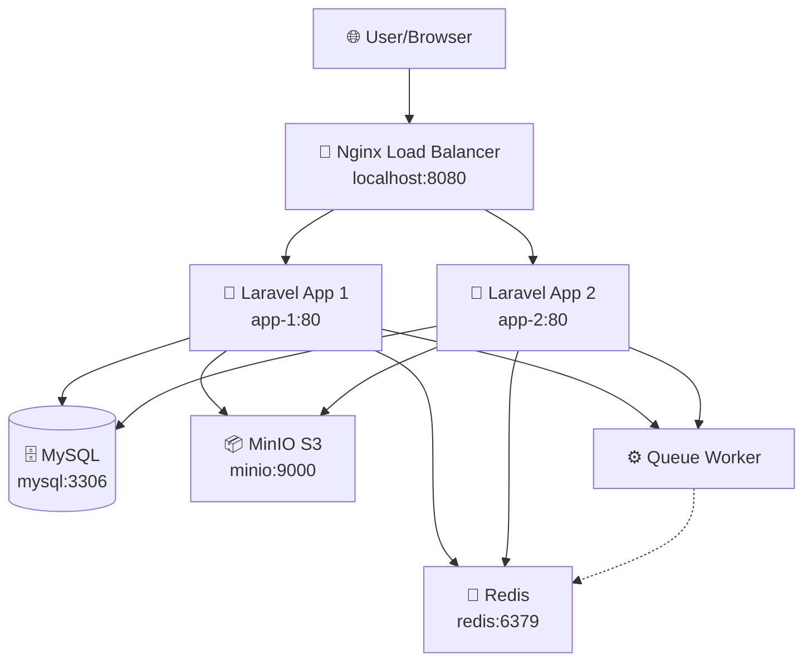
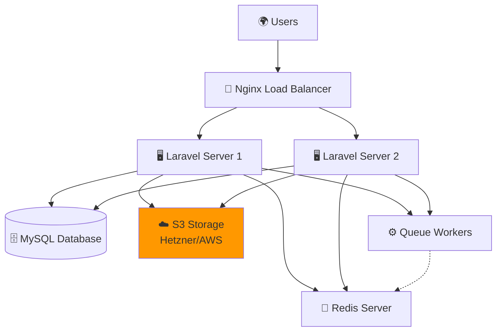

# **Local DevOps Demo with Docker**

## 🎯 Project Overview

A complete, locally-deployable demonstration of scalable Laravel infrastructure showcasing load balancing, high availability, session sharing, and S3 storage - all running on your local machine using Docker.

## 🏗️ **Architecture**

### **Local Docker Architecture**



### **Production Architecture (Same but Real Services)**



**Note:** Production uses the exact same architecture but with real cloud services instead of local containers.

## 🚀 **Quick Start**

### **Windows**

```batch
start.bat    # Start everything
Dockerfile   # Setup
docker-composer.yml
```

## 📊 **Access Points**

| Service              | URL                                   | Purpose                         |
| -------------------- | ------------------------------------- | ------------------------------- |
| **Main Application** | http://localhost:8080                 | Laravel app with load balancing |
| **File Upload**      | http://localhost:8080                 | Upload files to S3              |
| **Queue Dashboard**  | http://localhost:8080/queue-dashboard | Monitor background jobs         |
| **MinIO Console**    | http://localhost:9001                 | View uploaded files             |
| **MySQL**            | localhost:3306                        | Database                        |
| **Redis**            | localhost:6379                        | Cache & sessions                |

**MinIO Credentials:** `minioadmin` / `minioadmin`

## 🧪 **What This Demo Shows**

### **1. Load Balancing**

- Two Laravel servers behind Nginx
- Round-robin traffic distribution
- Session persistence across servers

**Test it:** Refresh http://localhost:8080 - watch the node change in navbar.

### **2. Session Sharing**

- Redis stores sessions
- Login works on any server
- CSRF tokens shared between servers

### **3. File Upload to S3**

- Upload files via web interface
- Files stored in MinIO (S3-compatible)
- Accessible from both app servers
- **Production:** Replace MinIO with Hetzner S3/AWS S3

### **4. Queue Processing**

- Background job processing
- Redis-based queues
- Monitor jobs in real-time

### **5. High Availability**

- Multiple app servers
- Shared database
- Centralized file storage
- Horizontal scaling ready

## 🔧 **Container Setup**

| Container       | Purpose            | Local Port |
| --------------- | ------------------ | ---------- |
| `laravel-lb`    | Load Balancer      | 8080       |
| `laravel-app-1` | Laravel Server 1   | -          |
| `laravel-app-2` | Laravel Server 2   | -          |
| `laravel-mysql` | MySQL Database     | 3306       |
| `laravel-redis` | Redis Server       | 6379       |
| `laravel-minio` | MinIO (S3 Storage) | 9000, 9001 |
| `laravel-queue` | Queue Worker       | -          |

## 🚨 **Troubleshooting**

### **Permission Errors:**

```bash
docker-compose exec app-1 chmod -R 775 storage bootstrap/cache
```

## 📚 **What This Proves to Clients**

### **For DevOps Role:**

1. ✅ **Load Balancing** - Nginx configuration
2. ✅ **High Availability** - Multiple servers
3. ✅ **Session Management** - Redis implementation
4. ✅ **Queue Processing** - Background jobs
5. ✅ **S3 Integration** - Object storage
6. ✅ **Docker Expertise** - Container orchestration
7. ✅ **Laravel Deployment** - Production-ready setup
