# **Local DevOps Demo with Docker**

## 🎯 Project Overview

A complete, locally-deployable demonstration of scalable Laravel infrastructure showcasing load balancing, high availability, session sharing, and S3 storage - all running on your local machine using Docker.

## 🏗️ **Architecture**

### **Local Docker Architecture**

```mermaid
graph TB
    USER[🌐 User/Browser] --> LB[🔄 Nginx Load Balancer<br/>localhost:8080]

    LB --> APP1[🐳 Laravel App 1<br/>app-1:80]
    LB --> APP2[🐳 Laravel App 2<br/>app-2:80]

    APP1 --> DB[(🗄️ MySQL<br/>mysql:3306)]
    APP1 --> REDIS[🔴 Redis<br/>redis:6379]
    APP1 --> MINIO[📦 MinIO S3<br/>minio:9000]
    APP1 --> QUEUE[⚙️ Queue Worker]

    APP2 --> DB
    APP2 --> REDIS
    APP2 --> MINIO
    APP2 --> QUEUE

    QUEUE -.-> REDIS
```



### **Production Architecture (Same but Real Services)**

```mermaid
graph TB
    USERS[🌍 Users] --> LB[🔄 Nginx Load Balancer]

    LB --> APP1[🖥️ Laravel Server 1]
    LB --> APP2[🖥️ Laravel Server 2]

    APP1 --> DB[(🗄️ MySQL Database)]
    APP1 --> REDIS[🔴 Redis Server]
    APP1 --> S3[☁️ S3 Storage\nHetzner/AWS]
    APP1 --> QUEUE[⚙️ Queue Workers]

    APP2 --> DB
    APP2 --> REDIS
    APP2 --> S3
    APP2 --> QUEUE

    QUEUE -.-> REDIS

    style S3 fill:#FF9800
```



**Note:** Production uses the exact same architecture but with real cloud services instead of local containers.

## 🚀 **Quick Start**

### **Windows**

```batch
start.bat    # Start everything
Dockerfile   # Setup
docker-composer.yml
```

## 📊 **Access Points**

| Service              | URL                                   | Purpose                         |
| -------------------- | ------------------------------------- | ------------------------------- |
| **Main Application** | http://localhost:8080                 | Laravel app with load balancing |
| **File Upload**      | http://localhost:8080                 | Upload files to S3              |
| **Queue Dashboard**  | http://localhost:8080/queue-dashboard | Monitor background jobs         |
| **MinIO Console**    | http://localhost:9001                 | View uploaded files             |
| **MySQL**            | localhost:3306                        | Database                        |
| **Redis**            | localhost:6379                        | Cache & sessions                |

**MinIO Credentials:** `minioadmin` / `minioadmin`

## 🧪 **What This Demo Shows**

### **1. Load Balancing**

- Two Laravel servers behind Nginx
- Round-robin traffic distribution
- Session persistence across servers

**Test it:** Refresh http://localhost:8080 - watch the node change in navbar.

### **2. Session Sharing**

- Redis stores sessions
- Login works on any server
- CSRF tokens shared between servers

### **3. File Upload to S3**

- Upload files via web interface
- Files stored in MinIO (S3-compatible)
- Accessible from both app servers
- **Production:** Replace MinIO with Hetzner S3/AWS S3

### **4. Queue Processing**

- Background job processing
- Redis-based queues
- Monitor jobs in real-time

### **5. High Availability**

- Multiple app servers
- Shared database
- Centralized file storage
- Horizontal scaling ready

## 🔧 **Container Setup**

| Container       | Purpose            | Local Port |
| --------------- | ------------------ | ---------- |
| `laravel-lb`    | Load Balancer      | 8080       |
| `laravel-app-1` | Laravel Server 1   | -          |
| `laravel-app-2` | Laravel Server 2   | -          |
| `laravel-mysql` | MySQL Database     | 3306       |
| `laravel-redis` | Redis Server       | 6379       |
| `laravel-minio` | MinIO (S3 Storage) | 9000, 9001 |
| `laravel-queue` | Queue Worker       | -          |

## 🚨 **Troubleshooting**

### **Permission Errors:**

```bash
docker-compose exec app-1 chmod -R 775 storage bootstrap/cache
```

### **Increase the Nginx App file size (default is 1m):**

```bash
docker-compose exec app-1 sh -c "sed -i '/client_max_body_size/ s/client_max_body_size[[:space:]]*[0-9]*[mM];/client_max_body_size 100M;/' /etc/nginx/nginx.conf"

docker exec -it laravel-app-1 nginx -s reload
```

## **Enviorment file .env**

```bash
APP_NAME=laravel-devops-demo
APP_ENV=local
APP_KEY=
APP_DEBUG=true
APP_URL=http://localhost:8080


DB_CONNECTION=mysql
DB_HOST=mysql
DB_PORT=3306
DB_DATABASE=laravel
DB_USERNAME=root
DB_PASSWORD=root

REDIS_HOST=redis
REDIS_PORT=6379
REDIS_CLIENT=phpredis

QUEUE_CONNECTION=redis
SESSION_DRIVER=redis
CACHE_DRIVER=redis

# Session using Redis
SESSION_DRIVER=redis
SESSION_CONNECTION=session
SESSION_LIFETIME=120
SESSION_SECURE_COOKIE=false
SESSION_PATH=/
SESSION_HTTP_ONLY=true
SESSION_SAME_SITE=lax
REDIS_PREFIX=laravel_shared:

COOKIE_DOMAIN=localhost
COOKIE_SECURE=false
SESSION_COOKIE=laravel_session

# S3/MinIO Configuration
AWS_ACCESS_KEY_ID=minioadmin
AWS_SECRET_ACCESS_KEY=minioadmin
AWS_DEFAULT_REGION=us-east-1
AWS_BUCKET=laravel
AWS_ENDPOINT=http://minio:9000
AWS_USE_PATH_STYLE_ENDPOINT=true

```

## 📚 **What This Proves of Opreation**

### **For DevOps Role:**

1. ✅ **Load Balancing** - Nginx configuration
2. ✅ **High Availability** - Multiple servers
3. ✅ **Session Management** - Redis implementation
4. ✅ **Queue Processing** - Background jobs
5. ✅ **S3 Integration** - Object storage
6. ✅ **Docker Expertise** - Container orchestration
7. ✅ **Laravel Deployment** - Production-ready setup
